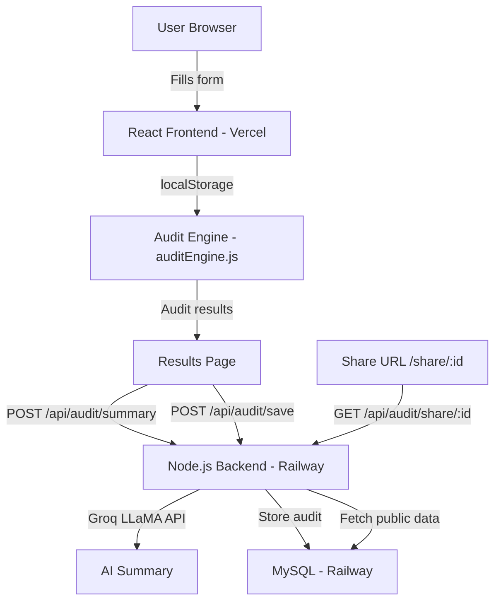

# Architecture

## System Diagram

## Data Flow

1. User fills the spend input form on the frontend
2. Form state persists to localStorage on every change
3. On submit, auditEngine.js runs entirely client-side — no API call needed for core audit logic
4. Results page fetches AI summary from backend using Groq LLaMA
5. User submits email → backend saves audit to MySQL with unique UUID
6. Share URL is generated — public version strips email and company name

## Stack Decisions

- **React.js** — chosen over Next.js because the assignment has a 7-day deadline and I know React deeply. Next.js would add SSR complexity without clear benefit for this use case.
- **Node.js + Express** — familiar, fast to build, sufficient for this scale
- **MySQL on Railway** — already have a Railway account, free tier sufficient, relational structure fits audit data well
- **Groq LLaMA** — free tier, extremely fast inference, sufficient quality for 100-word summaries
- **Audit engine client-side** — keeps latency near zero for the core feature. No API round-trip needed for math.

## Scaling to 10k Audits/Day

- Move audit engine to backend with Redis caching for common tool combinations
- Add a CDN layer (Cloudflare) in front of Vercel
- Switch MySQL to PlanetScale for horizontal scaling
- Add a queue (BullMQ) for email sending
- Add rate limiting per IP using Redis